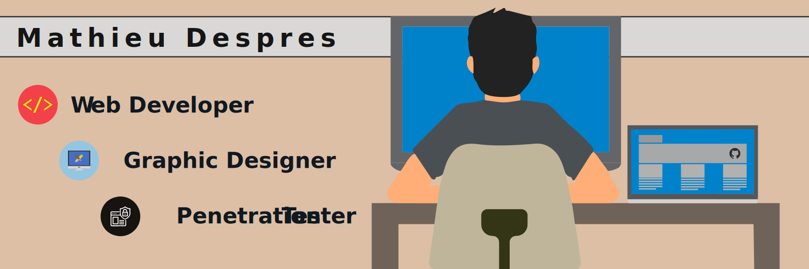

<!--
**Mathieu-Despres/Mathieu-Despres** is a ✨ _special_ ✨ repository because its `README.md` (this file) appears on your GitHub profile.

Here are some ideas to get you started:

- 🔭 I’m currently working on ...
- 🌱 I’m currently learning ...
- 👯 I’m looking to collaborate on ...
- 🤔 I’m looking for help with ...
- 💬 Ask me about ...
- 📫 How to reach me: ...
- 😄 Pronouns: ...
- ⚡ Fun fact: ...
-->

 

 

### 👨‍💻 About Me ###

 

Hi, my name is Mathieu Despres ("Matt" is fine). From the atlantic maritimes, I'm from a small town in New-Brunswick, Canada. Learning and exploring technologies is what I like to do. I usually wear many hats in the computer world, but my main areas are web developing, graphic designing and ethical hacking / pen testing.

Please check out my website where you can learn more information about me. I show academic work, including my skills, samples, and visual demonstrations of what I can do. My story can also be found on the website.

I'm open to feedback and suggestions about my presence on the internet! I am also looking to collaborate on any web projects. You can shoot me an email. I will most likely respond the same day.

 

### 📌 Pinned Repositories ###

 

<meta name="viewport" content="width=device-width, initial-scale=1">
<link rel="stylesheet" href="https://www.w3schools.com/w3css/4/w3.css">

<table align="center"

<tr>
<td>
<a href="https://github.com/Mathieu-Despres/prework-study-guide">

</td>
<td>
<a href="https://github.com/Mathieu-Despres/mattyd-professional-portfolio">

</td>
</tr>

<tr>
<td>
<a href="https://github.com/Mathieu-Despres/HTML-CSS-code-refactor">

</td>
<td>
<a href="https://github.com/Mathieu-Despres/mattyd-password-generator">

</td>
</tr>

</table>

 

### ✅ Stats ###

 

 

### 💼 Skills ###

 

  

More Skills

  

(<a href="#readme-top">back to top</a>)

